[](https://creativecommons.org/licenses/by-nc-sa/4.0/legalcode)


# NoduleNet: Decoupled False Positive Reduction for Pulmonary Nodule Detection and Segmentation
## License

Copyright (C) 2019 University of California Irvine and DEEPVOXEL Inc.  All rights reserved.
Licensed under the CC BY-NC-SA 4.0 license (https://creativecommons.org/licenses/by-nc-sa/4.0/legalcode). 

**This software is licensed for non-commerical research purpose only.**

## Paper

This paper has been accepted to MICCAI' 2019. 

If you use the code in your research, we would appreciate it if you can cite this paper.
```
@article{DBLP:journals/corr/abs-1907-11320,
  author    = {Hao Tang and
               Chupeng Zhang and
               Xiaohui Xie},
  title     = {NoduleNet: Decoupled False Positive Reductionfor Pulmonary Nodule
               Detection and Segmentation},
  journal   = {CoRR},
  volume    = {abs/1907.11320},
  year      = {2019},
  url       = {http://arxiv.org/abs/1907.11320},
  archivePrefix = {arXiv},
  eprint    = {1907.11320},
  timestamp = {Thu, 01 Aug 2019 08:59:33 +0200},
  biburl    = {https://dblp.org/rec/bib/journals/corr/abs-1907-11320},
  bibsource = {dblp computer science bibliography, https://dblp.org}
}
```

## Table of contents

<!--ts-->
* [Introduction](#introduction)
    * [Loss function](#loss-function)
    * [Training details](#training-details)
* [Install dependencies](#install-dependencies)
* [Usage](#usage)
    * [Preprocess](#preprocess)
    * [Train](#train)
    * [Evaluate](#evaluate)
    * [Cross validation](#6-fold-cross-validation)
<!--te-->

## Introduction

This is the codebase for performing pulmonary nodule detection and segmentation (end-to-end) using computed tomography (CT) images. Details about the methodolgy and results are in the aforementioned paper. Because of the limited space in the paper, we will elaborate the technical details here.

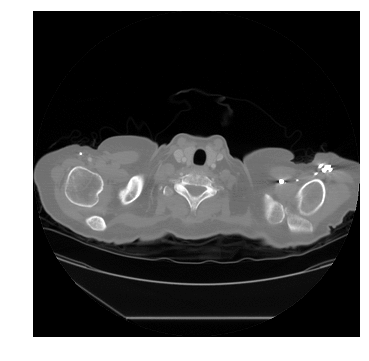 

The detailed model architecture is demonstrated in the following figure. 
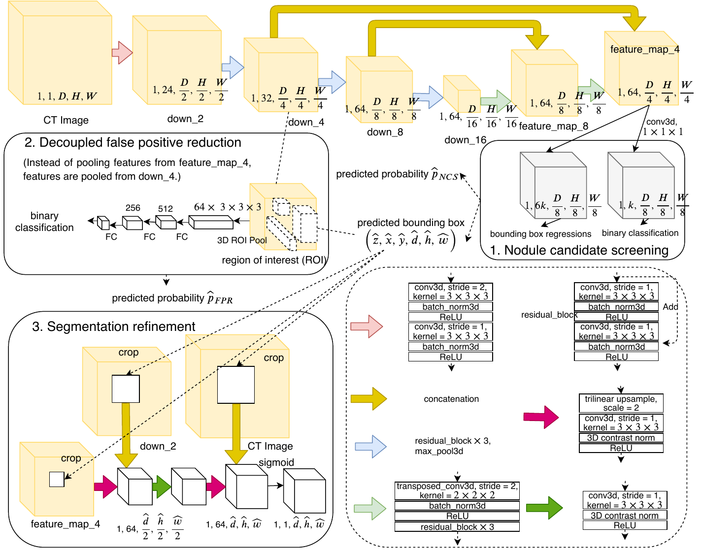

### Loss function
First, we go into more details of the loss function of each branch.

1. Nodule candidate screening
The loss function is defined as:
<p align="center">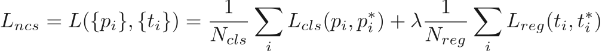</p>

where 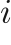 is the index of 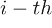 anchor in one CT image, 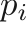 is its predicted probability that this anchor contains nodule candidate and 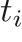 is a vector denoting the six parameterized coordinate offsets of this anchor with respect to the ground truth box. 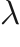 is a hyper parameter balancing the two losses and we set it to 1 in this work. 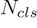 is the total number of anchors chosen for binary classification loss and  is the total number of anchors considered for computing regression loss. 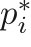 is 0 if  anchor does not contain any nodule and 1 otherwise. 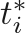 is the ground truth vector for six regression terms and is formally defined as (we ignore subscript  for notational convenience):
<p align="center">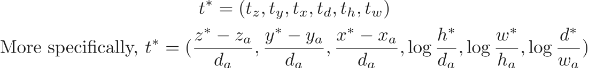</p>

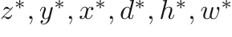 represent the center coordinates, depth, height and width of the ground truth box.  denote those for the anchor box. We use weighted binary cross entropy loss with hard negative example mining (OHEM) and smooth  loss for 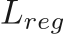. The foreground and background ratio of OHEM is set to 1:3 is used in this work.

2. Decoupled false positive reduction
The false positive reduction network minimizes the same multi-task in loss function as the NCS above, we call it 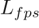, where the 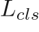 is a weighted binary cross entropy loss and  remains the same. (We actually do not need to predict the regression terms in the false positive reduction branch. We can only include the  part.)

3. Segmentation refinement
We then transform the detected bounding box representation from 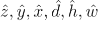 to 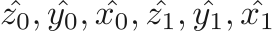. These two representations are exactly the same. To solve the misalignment caused by the rounding of floating points, we round the bounding box coordinate to the nearest integer that is a multiple of four (because the smallest feature map for SR is feature_map_4, which is downsampled by a factor of 4). Also, to ensure the rounding operation would not make the detected region smaller (which may cut off some part of the nodule), we round 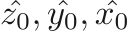 to the biggest integer (that is a multiple of four) that is smaller than , and 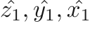 to the smallest integer (that is a multiple of four) that is larger than .

The segmentation refinement network minimizes the soft dice loss of the predicted mask sets 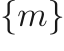 and the ground truth mask sets 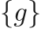 of the input image.
<p align="center">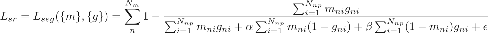</p>

where  is the total number of nodules in the input CT scan, 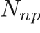 is the number of pixels in the 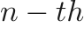 nodule mask. 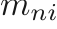 and 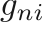 denote the predicted probability of the  voxel of the  mask being a foreground, and the ground truth of that voxel respectively. 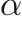 and 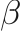 are parameters controlling the trade-off between false positives and false negatives, and we set them both to 0.5 in this work.

The whole framework is end-to-end. So the final loss is the sum of the losses from three branches:
<p align="center">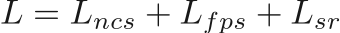</p>

There could be a term for each of the three losses to control the contribution of different branches. We just used a straightforward add here, because we thought the framework is not very sensible to this.

### Training details
The whole network was trained fully end-to-end. A gold standard nodule box is a rectangle cuboid that contains the nodule with a margin 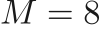 to its border voxels in all three axes. For NCS an anchor that has intersection over union (IoU) equal to or greater than 0.5 with any gold standard nodule box is considered as positive, whereas an anchor that has an IoU less than 0.1 is considered as negative. 

For each gold standard nodule box, if there does not exist any anchor that has an IoU equal or greater than 0.5, then the anchor that has the largest IoU is considered as positive.  

Non-maximum suppression (NMS) is performed among all predicted proposals to reduce redundant predictions pointing at the same nodule.

nodule proposals that have IoUs equal to or greater than 0.5 are chosen as positive samples for training decoupled false positive reduction (DFPS) branch, whereas IoUs less than 0.2 are considered as negative. 

In order to mitigate the effect of failing to detect the regions that contain nodule by NCS during training, we add the gold standard nodule box when training the DFPS branch.

Since NMS may require a lot of time if the number of positive nodule proposals is large, as is often the case during the first several iterations especially using 3D images, NCS is trained first for a few epochs and then DFPS and segmentation are added to be trained jointly for more computational efficiency.

We trained NoduleNet for a total of 200 epochs in all experiment. We used SGD as optimizer, with initial learning rate set to 0.01 and 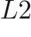 penalty set to 0.0001. The learning rate decreases to 0.001 after 100 epochs and to 0.0001 after 160 epochs. Batch size was set to 16. NCS branch was first trained for 65 epochs. Next, DFPS branch was added for training for 15 more epochs. Lastly, nodule segmentation network was added for training for the rest 120 epochs. Training was done using 4 1080ti GPUs.

## Install dependencies

1. We recommend using Python >= 3.6 (Python 2.7 may also work), cude >= 9.0 and PyTorch 1.1 (https://pytorch.org). We highly recommend using conda for managing all the packages.
```
conda install -c conda-forge pydicom
conda install opencv
conda install tqdm
```

**Note: The packages listed here may not be complete. If you run into missing packages, you may want to google and install it.**

3. Install a custom module for bounding box NMS and overlap calculation.

```
cd build/box
python setup.py install
```

3. In order to use Tensorboard for visualizing the losses during training, we need to install tensorboard.

```
pip install tb-nightly  # Until 1.14 moves to the release channel
```

### Data

There are two types of annotations we will encounter: one that only has the location of the nodule, and another that has segmentation mask for the nodule. The first one is more common in practice, since contouring the nodule on images takes radiologists more time and effort. Our framework can handle both cases. 

The dataset that has nodule segmentation is the public LIDC dataset. More common dataset would be the ones like LUNA16 that only has nodule locations.

You may have noticed in the dataset folder, there are two readers for loading the two types of data we have: mask_reader.py and bbox_reader.py.


## Usage

### Preprocess

You can download the preprocessed data from [here](<https://drive.google.com/open?id=1UqcIn2NsdOYbmCCwhjmwSbCmpAJCQmSB>)

Or, you can run through the following data preprocessing pipeline.

First, we need to preprocess the dicom images. The preprocessing includes: segmenting lung regions from the CT image, resampling the image into 1x1x1 mm spacing and converting world coordinates to voxel coordinates. All the results will be saved as .npy files. (You would better to equip youself with the notion of world coordinate and voxel coordinate, and how they are converted to each other. Tutorials on this can be found in LUNA16 Challenge.)

Then, you will need to specify which samples to be used for training, validing and testing. This can be done by generating a csv files containing patient ids for each phase and specify their paths in the config.py

To be more specific about this paper, we hereby walk you through the configuration to generate the preprocessed data for training and evaluation. 

First, we will need to download those files: 
1. Download the LIDC-IDRI Radiologist Annotations/Segmentations (XML format) from https://wiki.cancerimagingarchive.net/download/attachments/1966254/LIDC-XML-only.zip?version=1&modificationDate=1530215018015&api=v2

    And change the config.py line 24 'annos_dir' to your downloaded path

2. Download the LIDC-IDRI CT images and the corresponding lung segmentation mask from LUNA16 challenge https://luna16.grand-challenge.org/Download/

    Move all downloaded CT images from the 10 folders to one folder, and change the config.py line 18 'data_dir' to the CT images directory (combining sub folders into one folder)

    And change the config.py line 27 'lung_mask_dir' to the segmentation mask.

    Explanantions on some intermediate results saved: ctr_arr_save_dir will be the place to save the parsed intermediate nodule masks for each annotator, and mask_save_dir is the folder to save the merged nodule mask. In mask_save_dir, there will be 1 - 4 four folders, containing nodule masks that are annotated by at least 1 - 4 annotators respectively. 

Then run 
```
cd utils/LIDC
python cvrt_annos_to_npy.py
```

Finally, we will resample the CT image to 1x1x1, as well as the nodule masks. All our training and evaluations are based on the resampled images. NoduleNet also works (training and testing) using CT images that are not resampled.

Go to utils/LIDC/preprocess.py, change lung_mask_dir to the lung segmentation mask you downloaded from step 2, nod_mask_dir to the mask_save_dir you specified in the previous step. Change save_dir to the place you want to save the preprocessed data. Then run
```
cd utils/LIDC
python preprocess.py
```

### Training

Change training configuration and data configuration in config.py, especially the path to your preprocessed data.

You can change network configuration in config.py, then run training script:

```
python train.py
```

We can visualize the losses during training using Tensorboard. E.g.
```
tensorboard --logdir=results/test_py37/runs --port=11001
```

### Pretrained weight
We have uploaded a model pretrained on 0 fold (https://drive.google.com/file/d/1B2aB_4HTw5OEe8jH6XPoQYRJw4hGuDXD/view?usp=sharing).

### Evaluation

Once training is done, you will need to change the 'initial_checkpoint' in config.py to the file path of the checkpoint you want to use. And then run the following command.

```
python test.py eval
```

You will see the results of FROC analysis both saved to files and printed on the screen.

### 6-fold cross validation
We performed 6-fold cross validation and following script can be used to run the 6-fold cross validation
```
cd scripts
bash cross_val_6fold.sh
```
We then manually concatenate the predictions of each fold into one csv, and then run the evaluation script.


## Acknowledgement
We used the code from [this repo](<https://github.com/zhwhong/lidc_nodule_detection>) to parse the lidc XML annotation.

Part of the code was adpated from [DSB2017 winning solution](<https://github.com/lfz/DSB2017>)
